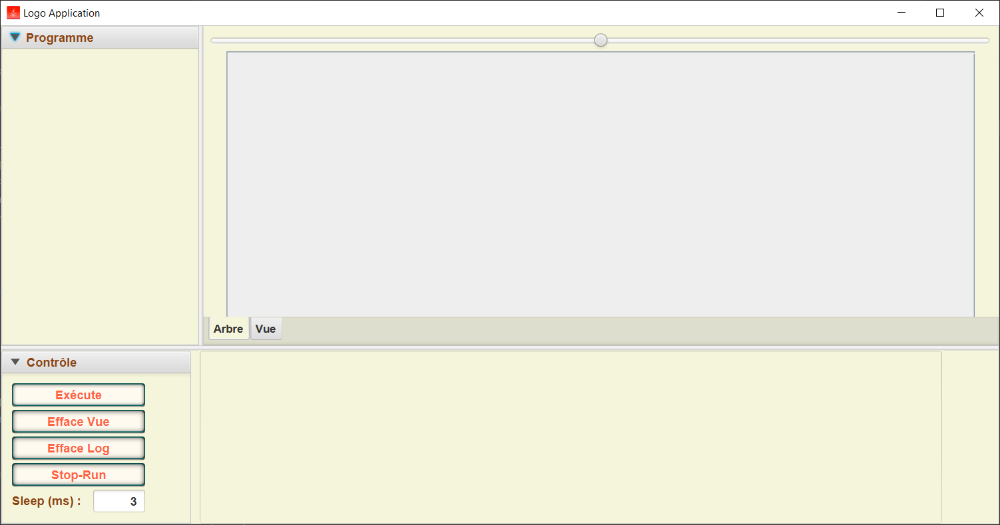

# TP AntLR

TP AntLR for AI21.

## Windows prerequisite

### Install chocolatey for install Java

Open an admin shell with `windows + R -> "powershell" -> ctrl + shift + enter` then enter:

```powershell
Set-ExecutionPolicy Bypass -Scope Process -Force; [System.Net.ServicePointManager]::SecurityProtocol = [System.Net.ServicePointManager]::SecurityProtocol -bor 3072; iex ((New-Object System.Net.WebClient).DownloadString('https://community.chocolatey.org/install.ps1'))
```

### Install Java

```powershell
choco install openjdk
```

## Mac prerequisite

Install java +11.

## Linux prerequisite

Install java +11.

## Fetch sources for dependencies

Install source with java-doc.

```sh
./mvnw dependency:sources
```

## Fetch project source

### Without git

```sh
curl -g https://codeload.github.com/Dashstrom/tp-antlr/zip/refs/heads/master --output tp-antlr.zip
tar xf tp-antlr-archive.zip
cd tp-antlr-main
```

### With git

```sh
git clone https://github.com/Dashstrom/tp-antlr.git
cd tp-antlr
```

## Build standalone jar

## Windows

```powershell
./mvnw.cmd clean package
```

## Mac and Linux

```sh
chmod +x mvnw
.\mvnw clean package
```

## Run program

```sh
java -jar target/ai21-antlr-1.0-SNAPSHOT-jar-with-dependencies.jar
```



## Development

Remake Maven wrapper (only if you know what you are doing).

```sh
mvn -N io.takari:maven:wrapper
```
